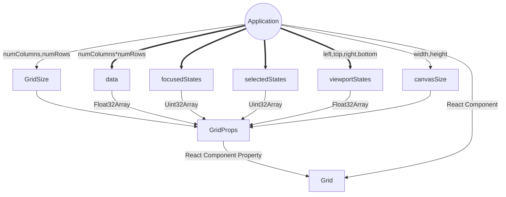
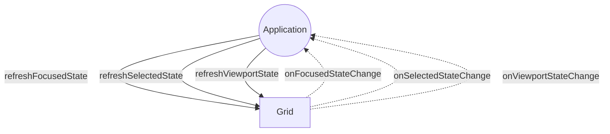
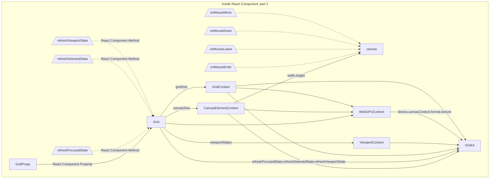
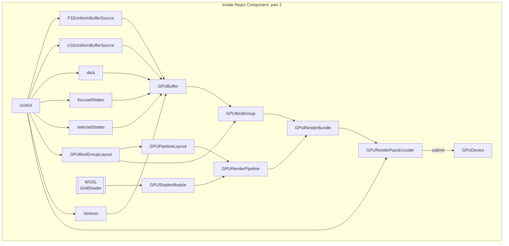

# WebGPU-React-Grid - A React component for visualizing a grid of values using WebGPU
[](https://github.com/ellerbrock/typescript-badges/)
[](https://badge.fury.io/js/webgpu-react-grid)
[](https://github.com/kubohiroya/webgpu-react-grid/blob/main/LICENSE)


WebGPU-React-Grid is an open-source React component for visualizing a grid of values using WebGPU.


- A React component displaying bitmap image data or grid data using WebGPU API directly
- Customizable for canvas size, grid size, viewport display size, header area size, and scrollbar size through React component props
- Uint32Array of RGBA color values or Float32Array of HSV color sources can be rendered using a WebGPU Shader Language program
- The display supports viewport navigation via mouse drag and scrollbar handling, and zoom in and out via mouse wheel
- Highlights the column and row under the current mouse pointer
- Toggle the selected state of each column and row, and highlight the selected ones
- Supports many-to-many relationship of viewports and grid data sources

# Live demo

[Live demo](https://kubohiroya.github.io/webgpu-react-grid/examples/index.html)

# Download and Installation

Download the latest version of WebGPU-React-Grid from the npm repository:

```bash
pnpm install webgpu-react-grid
```

# API

[doc](https://kubohiroya.github.io/webgpu-react-grid/modules.html)

# Usage

```tsx
import { Grid, GridHandles } from "webgpu-react-grid";
import { useRef } from "react";

const gridSize = { numColumns: 128, numRows: 128 };
const gridSizeMax = Math.max(gridSize.numColumns, gridSize.numRows);

const data =  new Float32Array(gridSize.numRows * gridSize.numColumns);
for (let i = 0; i < data.length; i++) {
  if (Math.random() < 0.99) {
    data[i] = i / data.length;
  } else {
    data[i] = Infinity;
  }
}

const focusedStates = new Uint32Array(gridSizeMax);
const selectedStates = new Uint32Array(gridSizeMax);

const viewportStates = new Float32Array([
  0.0, 0.0, 16.0, 16.0, // viewport index 0: left, top, right, bottom
  8.0, 8.0, 24.0, 24.0, // viewport index 1: left, top, right, bottom
]);

export const GridExample = () => {
  const gridRefs =
    [
      useRef<GridHandles>(null),
      useRef<GridHandles>(null)
    ];

  return (
    <>
      <Grid
        index={0}
        ref={gridRefs[0]}
        numViewports={2}
        headerOffset={{ left: 28, top: 28 }}
        canvasSize={{ width: 512, height: 512 }}
        scrollBar={{
          radius: 5.0,
          margin: 2.0,
        }}
        gridSize={gridSize}
        data={data}
        focusedStates={focusedStates}
        selectedStates={selectedStates}
        viewportStates={viewportStates}
        onFocusedStateChange={(sourceIndex: number, columnIndex: number, rowIndex: number) => {
          gridRefs[1].current?.refreshFocusedState(sourceIndex, columnIndex, rowIndex);
        }}
        onSelectedStateChange={(sourceIndex:number, columnIndex: number, rowIndex: number) => {
          gridRefs[1].current?.refreshSelectedState(sourceIndex, columnIndex, rowIndex);
        }}
        onViewportStateChange={(sourceIndex: number) => {
          gridRefs[1].current?.refreshViewportState(sourceIndex);
        }}
      />
      <Grid
        index={1}
        ref={gridRefs[1]}
        numViewports={2}
        headerOffset={{ left: 28, top: 28 }}
        canvasSize={{ width: 512, height: 512 }}
        scrollBar={{
          radius: 5.0,
          margin: 2.0,
        }}
        gridSize={gridSize}
        data={data}
        focusedStates={focusedStates}
        selectedStates={selectedStates}
        viewportStates={viewportStates}
        onFocusedStateChange={(sourceIndex: number, columnIndex: number, rowIndex: number) => {
          gridRefs[0].current?.refreshFocusedState(sourceIndex, columnIndex, rowIndex);
        }}
        onSelectedStateChange={(sourceIndex: number, columnIndex: number, rowIndex: number) => {
          gridRefs[0].current?.refreshSelectedState(sourceIndex, columnIndex, rowIndex);
        }}
        onViewportStateChange={(sourceIndex: number) => {
          gridRefs[0].current?.refreshViewportState(sourceIndex);
        }}
      />
    </>
  );
}
```
# Design








# Prerequisites:
- WebGPU compatible browser (e.g. Chrome with WebGPU enabled)
- react: `^18.2.0`
- react-dom: `^18.2.0`

# Licensing

WebGPU-React-Grid is published under the MIT License (MIT).

(c) 2024 Hiroya Kubo

Permission is hereby granted, free of charge, to any person obtaining a copy of this software and associated documentation files (the "Software"), to deal in the Software without restriction, including without limitation the rights to use, copy, modify, merge, publish, distribute, sublicense, and/or sell copies of the Software, and to permit persons to whom the Software is furnished to do so, subject to the following conditions:

The above copyright notice and this permission notice shall be included in all copies or substantial portions of the Software.

THE SOFTWARE IS PROVIDED "AS IS", WITHOUT WARRANTY OF ANY KIND, EXPRESS OR IMPLIED, INCLUDING BUT NOT LIMITED TO THE WARRANTIES OF MERCHANTABILITY, FITNESS FOR A PARTICULAR PURPOSE AND NONINFRINGEMENT. IN NO EVENT SHALL THE AUTHORS OR COPYRIGHT HOLDERS BE LIABLE FOR ANY CLAIM, DAMAGES OR OTHER LIABILITY, WHETHER IN AN ACTION OF CONTRACT, TORT OR OTHERWISE, ARISING FROM, OUT OF OR IN CONNECTION WITH THE SOFTWARE OR THE USE OR OTHER DEALINGS IN THE SOFTWARE.

# Author

Hiroya Kubo
